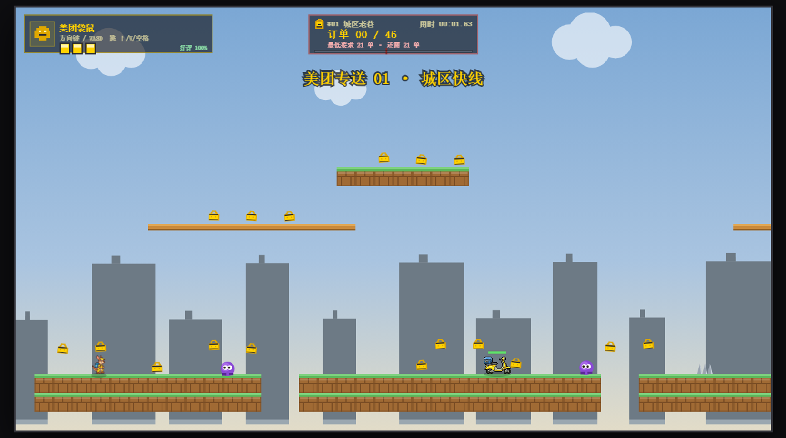

# 第十一单外卖

一款以外卖配送为主题的 2D 横版平台跳跃游戏，使用原生 JavaScript 和 Canvas 2D 开发。

玩家需要在关卡中收集订单、跨越障碍，并在时限内完成配送。项目当前以单人玩法为重点，本地双人和异地联机入口保留为开发中功能。

> 项目仍在持续开发中。公开仓库只包含已审核的发布副本；联机服务和部分角色素材不属于稳定公开发行范围。

## 在线试玩

启用 GitHub Pages 后，可在仓库的 `Settings -> Pages` 中确认公开地址。在线版对应 `main` 分支的 `src/`，适合体验单人模式。

## 游戏画面



## 玩法与系统

- 平台跳跃、二段跳、墙跳和冲刺。
- 多章节配送关卡、机关、移动平台和天气机制。
- 角色选择、角色解锁、动作成长和成就。
- 浏览器本地账号与存档。
- 电脑和手机设备模式。
- 单文件 HTML 打包，方便离线体验单人玩法。

本地账号不是服务端身份认证；存档保存在当前浏览器中，不等于跨设备云存档。异地联机依赖外部云服务、网络连接和服务端配置，不能保证在自行部署的域名下直接可用。

## 技术栈

HTML、CSS、JavaScript、Canvas 2D、Web Audio API。

游戏核心无需框架。开发、构建及测试脚本使用 Node.js；浏览器测试使用开发依赖 `chrome-remote-interface`，部分测试还需要本机 Chrome。

## 本地运行

环境要求：Node.js 18 或更高版本、现代浏览器。

在项目根目录运行：

```sh
npm ci
npm run serve
```

浏览器访问 `http://127.0.0.1:8080/`。

端口被占用时：

```sh
node tools/serve.js 3000
```

## 构建单文件版

```sh
npm run build
```

输出位置：`dist/第十一单外卖-单文件版.html`。

单文件版可用于离线单人体验；异地联机仍需要联网及正确配置。构建产物由源码生成，请勿直接修改。

## 测试

```sh
npm test
npm run test:browser
npm run test:singlefile
```

这些是项目现有测试入口，不代表全部测试已通过。浏览器测试的运行条件以具体脚本为准。

## 目录

```text
src/          页面、游戏逻辑及运行资源
tests/        自动化测试
tools/        开发、构建及资源处理工具
dist/         构建输出，不纳入首次源码上传
```

## 项目状态

个人开发项目，持续迭代中。单人模式是主要开发方向，其他模式的稳定性和兼容性仍需验证。

## 权利与素材

源码使用 MIT License，详见 [`LICENSE`](LICENSE)。游戏素材不随源码许可证自动授权，详见 [`ASSET-LICENSE-NOTICE.md`](ASSET-LICENSE-NOTICE.md)。

项目存在角色原型、品牌元素和二创素材，相关权利不因上传代码而转移。公开发布前需确认素材来源与使用权限，或替换为自有、明确获授权的素材。本项目不声称得到相关品牌或角色权利人的认可。

## 反馈

欢迎通过 GitHub Issues 提交问题。请附上设备、浏览器、所在关卡、复现步骤和截图，避免提交个人联系方式或存档中的敏感信息。

## 上传副本说明

本副本保留单人游戏源码，移除了个人微信彩蛋图片和生产云服务配置。异地联机需要自行配置已授权的服务。`test:egg` 是原个人二维码的验收测试，不适用于本副本；其他浏览器测试也可能包含原开发电脑的路径。

## 发布与开发

- [变更日志](CHANGELOG.md)
- GitHub Actions 会自动执行 Node 测试和单文件构建。
- `dist/` 默认不提交；需要离线版本时运行 `npm run build`，或从 GitHub Releases 下载附件。
